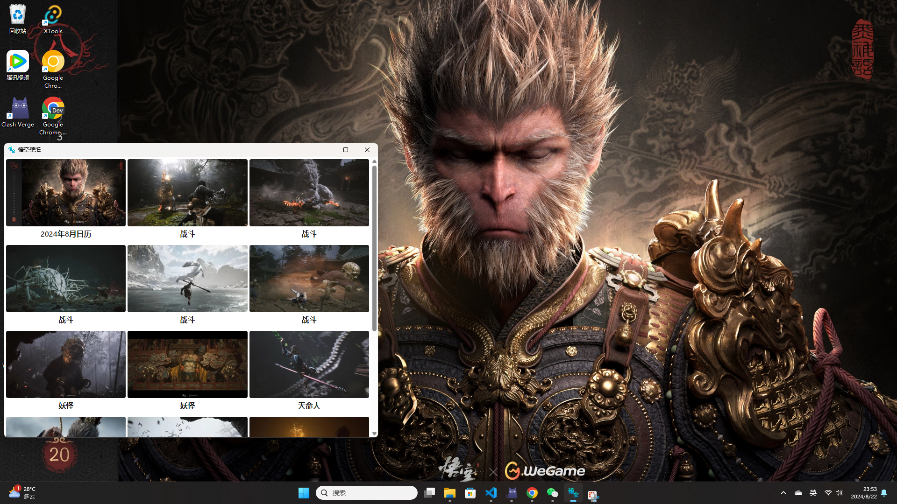

# 悟空壁纸

<div align="center">
  <p>
    
    
    
    
  </p>
</div>

## 截图

### mac


### win



## 下载

https://github.com/Xutaotaotao/wukong-wallpaper/releases

## 本地开发

### 安装依赖

```bash
pnpm i
```

### 运行


```bash
pnpm tauri dev
```

### 打包

```bash
pnpm tauri build
```

## 已知问题
- Mac 端扩展屏幕壁纸不同步，确保扩展屏幕在主屏幕即可。
- Mac 首次使用文件权限提醒：直接允许之后就可以使用。
- Windows 下载 & 安装阻止：解除安全限制即可使用，原因是因为没有签名。

## 联系作者

微信扫码即可联系


